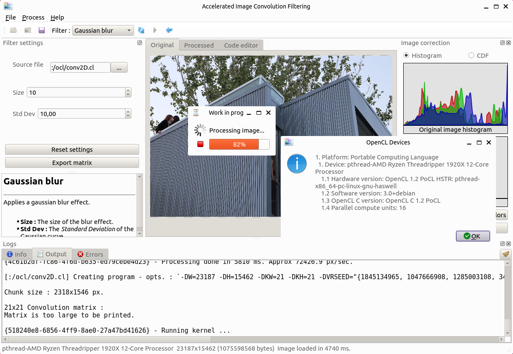

# ImgConv
## An image convolution filtering program written in C++ and OpenCL

|  |
| :---: |
| Screen capture on Windows |

This program is written in C++ (using the Qt framework for the GUI), and OpenCL is used for the actual image processing.

### Working principle

This program computes a discrete $2D$ convolution between a matrix (aka. kernel) and an input image :

$y(m, p)=\sum_{k=0}^{n_h-1}\sum_{j=0}^{n_w-1} x(m, p)h(m-j,p-k)$

Where :
- $x$ is the input image
- $y$ is the output image
- $m$, $p$ are respectively the $(x,y)$ coordinates of a pixel in the image
- $n_w$, $n_h$ are respectively the width and height of the kernel

The kernel coefficients define what kind of filter is applied to the image (see [Kernel (image processing)](https://en.wikipedia.org/wiki/Kernel_(image_processing))).
The convolution matrices are generated procedurally in accordance to the user's inputs. 

One can observe that the calculation of each $y(m, p)$ is independant. Since the computation can be completely parallelized, the algorithm is written in OpenCL to speed-up the process by running as many kernels in parallel as possible.

### Presentation

- The user can open an image, select an effect, adjust the parameters and then run the convolution. The program automatically generates a matrix according to the effect settings then compute the convolution.

- A brief explanation of each effect and his settings is given in a text box.

- The output image can be fed back to the input to chain effects.

- The user can also import its own matrix to apply custom effects.

- Some other useful features are implemented such as color-to-grascale conversion, color inversion and histogram equalization.

- The user can select on which OpenCL-compatible device the kernel must run.

An integrated code editor allows the user to edit its own OpenCL program, and so build much more complex effects :
| Code editor | Example of complex effect |
| :---: | :---: |
|  |  |

A tiny OpenCL ["library"](ImgConv/kCLinclude/) was developped to provide basic pixel manipulation, convolution, geometry primitives, etc...

OpenCL code examples are provided in the [ImgConv/code_examples](ImgConv/code_examples) folder. The code editor can also generates basic code templates to be able start more easily.

Since an OpenCL kernel cannot be canceled, the convolution operation is divided in chunks (factor adjustable by the user) so the overall process can be monitored and the user can abort the process.

For now, french translations are available, through the _Help > Language_ menu.

### Build steps

#### Windows

Prerequisites : 
- Make sure Qt (6 or later, MinGW kit) is installed
- Make sure Git is available (needed for qmake to get the current git revision)
- Make sure OpenCL runtime + drivers are installed (needed for the program to run)

Steps :
1. Clone the repo
2. Open [ImgConv.pro](ImgConv/) with QtCreator
3. Set the kit to ``Desktop Qt 6.X.X MinGW 64-bit`` when asked
4. Run qmake
5. Build
6. Copy [kCLinclude](ImgConv/) folder in the same folder as the executable
7. Run

No external dependencies should be needed to actually build the project.

To be able to run the program, OpenCL runtime must be installed, and _at least_ one OpenCL-compatible device must be available with his driver installed.

#### Linux

Prerequisites : 
- Make sure Qt (6 or later, GCC) is installed \[Qt online installer + ``apt install build-essential``\]
- Make sure Git is available (needed for qmake to get the current git revision) \[``apt install git``\]
- Make sure OpenCL dev package are installed : \[``apt install opencl-headers``, ``apt install ocl-icd-opencl-dev``\]
- Make sure OpenCL runtime + drivers are installed (needed for the program to run) \[tested on Ubuntu with VMware Workstation, PoCL driver for the CPU : ``sudo apt-get install libpocl2``\]

Steps :
1. Clone the repo
2. Open [ImgConv.pro](ImgConv/) with QtCreator
3. Set the kit to ``Desktop Qt 6.X.X GCC 64bit`` when asked
4. Run qmake
5. Build
6. Copy [kCLinclude folder](ImgConv/) in the same folder as the executable
7. Run

No external dependencies other than OpenCL should be needed to actually build the project.

To be able to run the program, OpenCL runtime must be installed, and _at least_ one OpenCL-compatible device must be available with his driver installed. PoCL can be used for this purpose.

|  |
| :---: |
| Screen capture on Linux (VM) |
